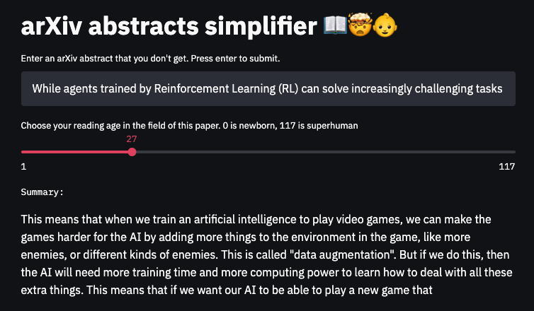

# arXiv abstracts simplifier

Having trouble understanding even the abstract of recent papers? You poor, simple thing.

Luckily, that puny meat computer of yours is useless anyway, thanks to [GPT-3](https://arxiv.org/abs/2005.14165)!

With this [Streamlit](https://streamlit.io) app, just enter the text of the abstract baffling you, and a cold,
brainless language model will explain it to you in age-appropriate detail.