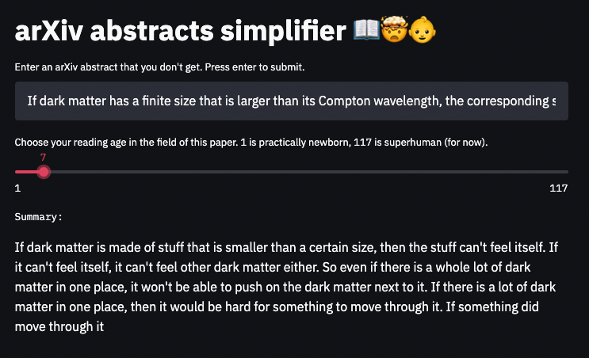

# arXiv abstracts simplifier



I'm a prompt engineer now! 🔥

Playing with OpenAI API to summarize arXiv abstracts in age-appropriate detail.

It doesn't work that well, but some examples have been funny!

# Prerequisites

- Access to the OpenAI API, and a valid API key.
- Python 3 (tested with 3.7.5)
- pip

# Running

From repo root, after `git clone https://github.com/masoncusack/arxiv-simplifier && cd arxiv-simplifier`:

```bash
pip install -r requirements.txt
export OPEN_AI_API_KEY="<your-api-key>"
streamlit run main.py
```